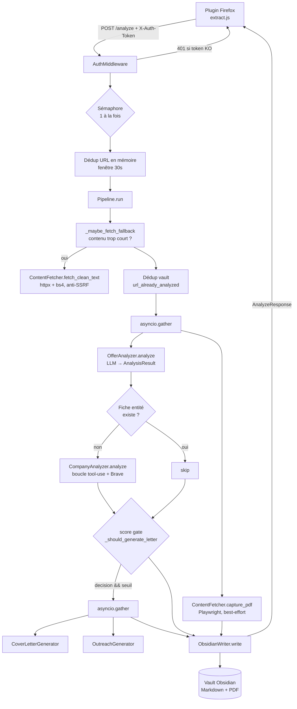

# Architecture — Job Set & Match V2

> Documentation d'orientation (carte du système). Pour l'installation et l'usage,
> voir le [README](../README.md). Pour le référentiel détaillé + les écarts à
> arbitrer, voir [reference.md](./reference.md).

## Quoi & pourquoi

Outil **personnel** de veille emploi. Une offre ouverte dans Firefox est capturée
par un plugin, envoyée à un backend FastAPI local, analysée par un (ou plusieurs)
LLM — scoring de l'offre, recherche sur l'entreprise, lettre de motivation,
artefacts d'approche — puis écrite sous forme de dossier Markdown structuré dans
un vault Obsidian. Obsidian sert à la fois de **stockage** et d'**UI** (dashboard
via Bases).

Idée centrale : *capture → analyse LLM multi-étapes → dossier vault*, le tout en
local, un seul utilisateur, une analyse à la fois.

## Ordre de lecture

Pour comprendre le système, lire dans cet ordre :

1. **[README](../README.md)** — ce que fait l'outil, comment l'installer/lancer.
2. **`app/models.py`** — les contrats. Tout transite par `AnalyzeRequest` /
   `AnalyzeResponse` ; le résultat LLM est `AnalysisResult` (+ `OutreachResult`).
   Lire les schémas avant le reste rend la suite évidente.
3. **`app/main.py`** — les deux points d'entrée (HTTP `POST /analyze` + mode CLI),
   le middleware d'auth, le sémaphore « une analyse à la fois », la déduplication
   d'URL.
4. **`app/pipeline.py`** — la colonne vertébrale. `Pipeline.run()` enchaîne toutes
   les étapes ; tout le reste est appelé d'ici. **C'est le fichier à maîtriser.**
5. **`app/services/*`** — une étape par service (voir tableau).
6. **`app/llm/*`** — l'abstraction multi-provider (Protocol + factory). À lire
   quand on veut comprendre comment un `model_id` devient un appel API.
7. **`config.yaml` + `app/config.py`** — la config métier (vault, modèles,
   températures, serveur) vs les secrets (`.env`).

## Composants

| Module | Responsabilité (une ligne) |
|---|---|
| `app/main.py` | App FastAPI : endpoints `/health` `/stats` `/analyze`, mode CLI, logging rotatif, lifespan, sémaphore, dédup URL en mémoire. |
| `app/pipeline.py` | Orchestrateur central : enchaîne fetch → analyse → entreprise → score gate → lettre/outreach → écriture vault. |
| `app/config.py` | `Settings` (secrets `.env`) + `AppConfig` (métier `config.yaml`) ; `LLMModelsConfig.resolve()` mappe service→modèle. |
| `app/models.py` | Schémas Pydantic : requête/réponse plugin, `AnalysisResult` (scoring), `OutreachResult`. |
| `app/vault_layout.py` | Parse la section `vault` de `config.yaml` (chemins, docs perso cacheables, override prompts). |
| `app/llm/` | Abstraction provider-agnostique : `protocol.py` (interface), `factory.py` (prefix→provider), clients Anthropic & OpenAI-compat. |
| `app/middleware/auth.py` | Vérifie `X-Auth-Token` (hmac.compare_digest) sauf chemins publics. |
| `app/prompts/` | Prompts LLM (analysis, company, generation, outreach) + `context.py` (assemblage de contexte). |
| `app/services/offer_analyzer.py` | Scoring de l'offre via LLM → `AnalysisResult` (JSON structuré). |
| `app/services/company_analyzer.py` | Recherche entreprise via boucle tool-use + Brave Search → rapport Markdown. |
| `app/services/cover_letter.py` | Génère la lettre de motivation (best-effort). |
| `app/services/outreach_generator.py` | Génère accroche LinkedIn + email + suggestions CV → `OutreachResult`. |
| `app/services/content_fetcher.py` | Fallback contenu (httpx+bs4) et capture PDF (Playwright). Validation anti-SSRF. |
| `app/services/document_loader.py` | Charge les docs perso du vault (CV, pitch…) en blocs système cacheables. |
| `app/services/obsidian_writer.py` | Écrit le dossier d'offre dans le vault ; dédup par URL et par entité. |
| `app/services/brave_search.py` | Client REST Brave Search (outil du CompanyAnalyzer). |
| `app/services/prompt_loader.py` | Charge un prompt depuis le vault (override) ou les constantes Python (fallback). |
| `app/utils/` | `dedup` (fenêtre anti-doublon), `paths` (slug + `ensure_within`), `token_logger`, `pricing` (coûts dynamiques), `prompt_version` (empreinte auto d'un prompt pour l'attribution). |
| `plugin/` | Extension Firefox MV3 : `extract.js` (contenu page), `service_worker.js` (POST backend, propage `refresh`), `popup` (UI + ré-analyse + config token, backend **loopback-only**). `sign.sh` signe l'extension (canal unlisted AMO). |

## Comment ça s'imbrique

Flux de contrôle d'une analyse (`POST /analyze`) :

Points clés du flux :
- **Parallélisme** : l'analyse d'offre et la capture PDF tournent ensemble
  (`gather`) ; idem lettre + outreach. Les erreurs PDF/lettre/outreach sont
  *best-effort* (loggées, n'avortent pas l'analyse) ; seule l'erreur d'analyse
  d'offre fait échouer le pipeline.
- **Deux niveaux de dédup** : en mémoire (`UrlDeduplicator`, fenêtre 30 s, dans
  `main.py`) puis sur le vault (`url_already_analyzed`, `company_exists`).
  `--refresh` / `refresh=true` bypasse les deux.
- **Score gate** : la lettre et l'outreach ne sont générés que si
  `decision == true` (et `chanceRating >= score_threshold` si seuil > 0).
- **Provider résolu par modèle** : chaque service reçoit un client LLM créé
  d'après le préfixe du `model_id` (voir `factory.py`). Un même provider peut
  servir plusieurs services ; un champ modèle vide retombe sur `default`.

## Frontières & points d'extension

- **Ajouter un provider LLM** → `app/llm/factory.py` (`_PROVIDER_REGISTRY`) +
  clé API dans `Settings` (`config.py`). Ne pas toucher aux services : ils sont
  provider-agnostiques (ils ne voient que `LLMClient`).
- **Changer un prompt** → `app/prompts/*.py` (source de vérité) ; override
  optionnel via le vault (section `prompts` de `config.yaml` + `PromptLoader`).
- **Ajouter une étape pipeline** → `app/pipeline.py`. Injecter les dépendances
  par le constructeur (pattern existant), garder le best-effort pour le non-critique.
- **Changer la structure du dossier vault** → `app/services/obsidian_writer.py`.
- **Ne pas toucher sans raison** :
  - `app/utils/paths.py` (`ensure_within`) — garde-fou path traversal.
  - `content_fetcher._validate_url` / `_guard_route` — garde-fou SSRF (voir la
    décision « revalidation par saut » et la limite DNS rebinding documentée).
  - `middleware/auth.py` — comparaison de token timing-safe.
- **Coûts tokens** : jamais hardcodés — résolus dynamiquement via `pricing.json`
  (partagé avec llm-sparring). Voir `app/utils/pricing.py`.
- **Distribuer le plugin durablement** → `plugin/sign.sh` (signature unlisted AMO,
  identifiants via `WEB_EXT_API_KEY`/`WEB_EXT_API_SECRET`). Choix « voie A » :
  garder le plugin custom (privilèges minimaux) plutôt qu'Automa. Voir README §Plugin.
- **Setup / Playwright** → `install.sh` (idempotent) : si le build Chromium de
  Playwright manque (OS récent), bascule sur un Chromium système et écrit
  `PLAYWRIGHT_CHROMIUM_EXECUTABLE_PATH` dans `.env` (lu par `content_fetcher`).

## Type de projet

**Service / API** local mono-utilisateur, avec un **second point d'entrée CLI**
(`python -m app.main`). L'emphase porte donc sur le cycle de vie de la requête et
les couches (auth → orchestration → services → vault), pas sur une surface
publique de librairie.
